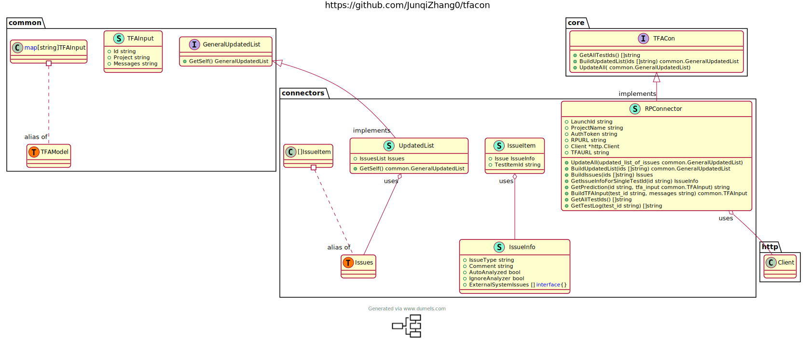

# Test Failure Classifier Connector 

## Description

## User Guide
### Installation
### Get Started
#### list
#### run
#### validate
#### init(To be added)
### Advanced usage
#### Set Concurrency(To be added)
#### Set retry(To be added)

## Developer Guide
### Archietrcue
#### UML graph

#### OOD brief explanation
### concurrency

## Contributor Guide
### Branch name

